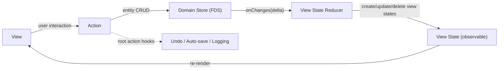

# Fusion
The library is experimental and subject to API changes.

Fusion provides shared infrastructure for building apps in Python and TypeScript. It's not a GUI framework — it provides entities, stores, actions, and channels, while leaving view/state binding to the platform (Qt, React+MobX, etc.).

Used in [Pamet](https://github.com/v-ko/pamet) (React+MobX web app, Qt WebEngine desktop) and vii-assistant (Python+Qt, not yet published).

## Installation
- Python: `pip install python-fusion`
- TypeScript: the `fusion/` package is used as a local dependency (see `js-src/`)

## Architecture

The architecture is inspired by the [Flux](https://facebookarchive.github.io/flux/) pattern and the standard MVC.

There's a domain store (the **frontend domain store** / FDS), which the UI operates with. Persistence is handled additionally. Changes in the FDS trigger updates to the view model — the UI components' **view states**. Views are implemented with a reactive framework (React+MobX or Qt), so any change to the view state triggers a re-render. Views can call **actions** (decorated functions). In actions, the view state can be altered, as well as the FDS (only there!). The changes are visualized to the user. And the cycle is completed.

After the outermost (root) action completes, **root action hooks** fire — used for undo recording, auto-save, logging, etc.



### Concepts

- **`Entity`** — base model class with serialization and a type registry (`@entityType`). Store operations produce `Change` objects (CREATE/UPDATE/DELETE), aggregated into `Delta`s.
- **`Store` / `InMemoryStore`** — entity CRUD. Every mutation fires the store's `onChanges` callback with the resulting `Delta`.
- **`@action`** — method decorator. Wraps calls in MobX `runInAction` (TS) or a call context (Python). Tracks a call stack so that only **root** action completion triggers hooks.
- **`Channel`** — named pub/sub bus for decoupled communication between services.

## Full example (TypeScript / React+MobX)

Below is a condensed but complete picture: entity, view state, store+reducer wiring, an action, a React component, and hook registration.

```typescript
// --- 1. Entity definition (fusion) ---
import { entityType, Entity, EntityData, getEntityId } from "fusion/model/Entity";

interface TodoData extends EntityData {
    text: string;
    done: boolean;
}

@entityType('Todo')
class Todo extends Entity<TodoData> {
    get text() { return this._data.text; }
    get done() { return this._data.done; }
}


// --- 2. View state (MobX — app-level, not part of fusion) ---
import { observable, makeObservable, ObservableMap } from "mobx";

class TodoViewState {
    _data: TodoData;
    constructor(todo: Todo) {
        this._data = todo.data();
        makeObservable(this, { _data: observable });
    }
    get text() { return this._data.text; }
    get done() { return this._data.done; }
}

class AppViewState {
    todosById: ObservableMap<string, TodoViewState> = observable.map();
    constructor() {
        makeObservable(this, { todosById: observable });
    }
}


// --- 3. Store + reducer wiring ---
import { InMemoryStore } from "fusion/storage/domain-store/InMemoryStore";
import { Delta } from "fusion/model/Delta";

const store = new InMemoryStore();
const appState = new AppViewState();

// The reducer: maps entity deltas to view state updates
store.onChanges = (delta: Delta) => {
    for (const change of delta.changes()) {
        if (change.isCreate()) {
            const todo = store.findOne({ id: change.entityId }) as Todo;
            appState.todosById.set(todo.id, new TodoViewState(todo));
        } else if (change.isUpdate()) {
            const todoVS = appState.todosById.get(change.entityId);
            if (todoVS) todoVS._data = { ...todoVS._data, ...change.forwardComponent };
        } else if (change.isDelete()) {
            appState.todosById.delete(change.entityId);
        }
    }
};


// --- 4. Actions ---
import { action, registerRootActionCompletedHook } from "fusion/registries/Action";

class TodoActions {
    @action
    addTodo(text: string) {
        const todo = new Todo({ id: getEntityId(), parent_id: '', text, done: false });
        store.insertOne(todo);  // → fires onChanges → reducer updates view state
    }

    @action
    toggleDone(todoId: string) {
        const todo = store.findOne({ id: todoId }) as Todo;
        const updated = todo.copy();
        updated.replace({ done: !todo.done });
        store.updateOne(updated);  // → fires onChanges → reducer updates view state
    }
}

const todoActions = new TodoActions();


// --- 5. Root action hooks (undo, auto-save, etc.) ---
registerRootActionCompletedHook((rootAction) => {
    // e.g. record undo, save to backend, log
    console.log('Action completed:', rootAction.name);
});


// --- 6. React component ---
import { observer } from "mobx-react-lite";

const TodoList = observer(({ state }: { state: AppViewState }) => (
    <ul>
        {[...state.todosById.values()].map(todoVS => (
            <li key={todoVS._data.id}
                style={{ textDecoration: todoVS.done ? 'line-through' : 'none' }}
                onClick={() => todoActions.toggleDone(todoVS._data.id)}>
                {todoVS.text}
            </li>
        ))}
        <button onClick={() => todoActions.addTodo('New item')}>Add</button>
    </ul>
));
```

The same pattern applies in Python/Qt — entities and stores are the same, view states use `QObject` + `Signal`, and widgets bind by connecting to signals:

```python
from PySide6.QtCore import QObject, Signal

class TodoViewState(QObject):
    text_changed = Signal(str)
    done_changed = Signal(bool)
    # ... property + setter that emits signal on change

class TodoWidget(QWidget):
    def __init__(self, state: TodoViewState):
        self._state = state
        self._state.done_changed.connect(self._apply_done)
```

## Testing
Both Python (`pytest`) and TypeScript test suites are available.


# Other
TODO: Compare with YJS
