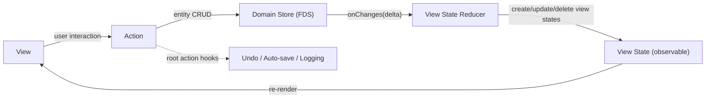

# Fusion
The library is experimental and subject to API changes.

Fusion provides shared infrastructure for building apps in Python and TypeScript. It's not a GUI framework — it provides entities, stores, actions, and channels, while leaving view/state binding to the platform (Qt, React+MobX, etc.).

Used in [Pamet](https://github.com/v-ko/pamet) (React+MobX web app, Qt WebEngine desktop) and vii-assistant (Python+Qt, not yet published).

## Installation
- Python: `pip install python-fusion`
- TypeScript: the `fusion/` package is used as a local dependency (see `js-src/`)

## Architecture

The architecture is inspired by the [Flux](https://facebookarchive.github.io/flux/) pattern and the standard MVC.

There's a domain store (the **frontend domain store** / FDS), which the UI operates with. Persistence is handled additionally. Changes in the FDS trigger updates to the view model — the UI components' **view states**. Views are implemented with a reactive framework (React+MobX or Qt), so any change to the view state triggers a re-render. Views can call **actions** (decorated functions). In actions, the view state can be altered, as well as the FDS (only there!). The changes are visualized to the user. And the cycle is completed.

After the outermost (root) action completes, **root action hooks** fire — used for undo recording, auto-save, logging, etc.



### Concepts

- **`Entity`** — base model class with serialization and a type registry (`@entityType`). Store operations produce `Change` objects (CREATE/UPDATE/DELETE), aggregated into `Delta`s.
- **`Store` / `InMemoryStore`** — entity CRUD. Every mutation fires the store's `onChanges` callback with the resulting `Delta`.
- **`@action`** — method decorator. Wraps calls in MobX `runInAction` (TS) or a call context (Python). Tracks a call stack so that only **root** action completion triggers hooks.
- **`Channel`** — named pub/sub bus for decoupled communication between services.

## Full example (TypeScript / React+MobX)

Below is a condensed but complete picture: entity, view state, store+reducer wiring, an action, a React component, and hook registration.

```typescript
// --- 1. Entity definition (fusion) ---
import { entityType, Entity, EntityData, getEntityId } from "fusion/model/Entity";

interface TodoData extends EntityData {
    text: string;
    done: boolean;
}

@entityType('Todo')
class Todo extends Entity<TodoData> {
    get text() { return this._data.text; }
    get done() { return this._data.done; }
}


// --- 2. View state (MobX — app-level, not part of fusion) ---
import { observable, makeObservable, ObservableMap } from "mobx";

class TodoViewState {
    _data: TodoData;
    constructor(todo: Todo) {
        this._data = todo.data();
        makeObservable(this, { _data: observable });
    }
    get text() { return this._data.text; }
    get done() { return this._data.done; }
}

class AppViewState {
    todosById: ObservableMap<string, TodoViewState> = observable.map();
    constructor() {
        makeObservable(this, { todosById: observable });
    }
}


// --- 3. Store + reducer wiring ---
import { InMemoryStore } from "fusion/storage/domain-store/InMemoryStore";
import { Delta } from "fusion/model/Delta";

const store = new InMemoryStore();
const appState = new AppViewState();

// The reducer: maps entity deltas to view state updates
store.onChanges = (delta: Delta) => {
    for (const change of delta.changes()) {
        if (change.isCreate()) {
            const todo = store.findOne({ id: change.entityId }) as Todo;
            appState.todosById.set(todo.id, new TodoViewState(todo));
        } else if (change.isUpdate()) {
            const todoVS = appState.todosById.get(change.entityId);
            if (todoVS) todoVS._data = { ...todoVS._data, ...change.forwardComponent };
        } else if (change.isDelete()) {
            appState.todosById.delete(change.entityId);
        }
    }
};


// --- 4. Actions ---
import { action, registerRootActionCompletedHook } from "fusion/registries/Action";

class TodoActions {
    @action
    addTodo(text: string) {
        const todo = new Todo({ id: getEntityId(), parent_id: '', text, done: false });
        store.insertOne(todo);  // → fires onChanges → reducer updates view state
    }

    @action
    toggleDone(todoId: string) {
        const todo = store.findOne({ id: todoId }) as Todo;
        const updated = todo.copy();
        updated.replace({ done: !todo.done });
        store.updateOne(updated);  // → fires onChanges → reducer updates view state
    }
}

const todoActions = new TodoActions();


// --- 5. Root action hooks (undo, auto-save, etc.) ---
registerRootActionCompletedHook((rootAction) => {
    // e.g. record undo, save to backend, log
    console.log('Action completed:', rootAction.name);
});


// --- 6. React component ---
import { observer } from "mobx-react-lite";

const TodoList = observer(({ state }: { state: AppViewState }) => (
    <ul>
        {[...state.todosById.values()].map(todoVS => (
            <li key={todoVS._data.id}
                style={{ textDecoration: todoVS.done ? 'line-through' : 'none' }}
                onClick={() => todoActions.toggleDone(todoVS._data.id)}>
                {todoVS.text}
            </li>
        ))}
        <button onClick={() => todoActions.addTodo('New item')}>Add</button>
    </ul>
));
```

The same pattern applies in Python/Qt — entities and stores are the same, view states use `QObject` + `Signal` + `Property`, and actions are `@action`-decorated functions.

```python
# --- View state ---
from fusion.platform.qt_widgets import Property
from PySide6.QtCore import QObject, Signal

class CounterState(QObject):
    count_changed = Signal(int)

    def __init__(self):
        super().__init__()
        self._count = 0

    @Property(int, notify=count_changed)
    def count(self) -> int:
        return self._count

    @count.setter
    def count(self, value: int):
        if self._count == value:
            return
        self._count = value
        self.count_changed.emit(value)

# --- Action ---
from fusion.libs.action import action

@action("counter.increment")
def increment(state: CounterState, amount: int = 1):
    state.count = state.count + amount
```

For QML, expose the state and a thin `@Slot` backend via `setContextProperty`. For QWidgets, connect to signals directly.

## Testing
Both Python (`pytest`) and TypeScript test suites are available.


# Other
TODO: Compare with YJS

# WIP concepts:
## Commands
Commands are one layer above the views. Typically activated by shortcuts, menu entries, or the command palette. Commands are enabled/disabled possibly based on a context dictionary, which is derived from the viewState (not imperatively altered!).

## Procedures
Procedures are async functions, that define .. procedures of several steps, that would need appState updates inbetween. So basically when you need an async action - you write a procedure. Example: loading data from a slow connection or doing a cpu task in a worker - you want to mark in the UI it's started (Loader dialog, freezing of elements, etc), do it, report progress, and close the dialog. All UI changes are made with calling action functions (synchronous) inbetween doing the async tasks.

## Main, Facade and progressive complexity of the app architecture
The main() entry point can be a whole app if we're building something simple.
Later we add modules when the code size baloons. Typically we're building services with a programatic interface (exposed OS-local or to the web) and/or OS-interactions (other local services or file-system) and/or UI-interactions.

The main() can hold everything, but for readability and for the sake of defering the import of heavy dependencies we split the code into modules (the source-tree).

Our program will probably need different configurations if ran on different devices or conditions. E.g. preferences passed by OS environment variables, per-run command line arguments, or auto-detected hardware and software conditions (gpu present, system color theme, etc.). The main() can still be the place to add this logic, but that can also baloon in size.
Something else that can baloon in size is the count of our objects dealing with all kinds of stuff - integration services, storage, UI-related classes. And ALL OF THEM want to talk to eachother. But if we start just wiring them together - that allows bugs of unimaginable complexity, along with making the code components untestable in isolation.

So we setup some conventions to deal with that.
- UI interactions are processed in layers as explained above (Views/ViewStates/
Actions/object Stores).
- Interactions with storage and networking (game progress save, document output, web collaboration) usually benifit Adapter classes, synchronization service classes, in-memory object Stores, etc. Persisting and sharing data can be *hard*.
- CPU heavy work or non-trivial data transformation logic needs its own patterns. Computing the next frame of the game or processing an inflow of user requests for your social network app can be an infinitely complex task, which should be split into a plethora of class types with specific responcibilities and lifecycle. I.e. there's no universal answer but good examples are:
  - Adapter - implements a stable interface to some other service (over network, other transport) or a storage medium (db, file-system). Does not have state.
  - Service - class instances that encapsulate some functionality and have state.
  - Manager - a service which composes several adapters or other services and coordinates their operation.

Access to all of those components, as mentioned above, should be controlled. E.g. a user presses ctrl+z and a view wants to call the undo service and restore the last revision to the document store. Or the rendering preparation service needs to call the physics engine to get some parameters of the new car-wreck that the user is about to cause in the game.
Some of this spaghetti is solved by doing heirarhy and scoping. The OOP principles apply here. But in reality even in a good hierarchy - the janitor may can say hi to the president. If the latter is not occupied.

**The facade is the place where we define which cross-hierarchy calls are allowed and when.** It's the place where we explicitly track coupling between components that live in different scopes or levels.

### Service dependencies, wiring and lifecycle
- Dependencies - services may use other objects for their operation (other services, functions, vars). They should receive them on construction and have them as narrow as possible. All services having access to the whole facade is risky.
- Wiring is e.g. the subscriptions of a service, connections to collaborators. Mostly setting up callbacks and messaging channels.
- Lifecycle is the enabling/disenabling (start/stop) of a service without scrapping it in the mean time.

Wiring can be done by the service itself on construction. Or if there are sibling services - it should be done by the parent. That's either the facade or if that gets overcrowded - we can group facade logic and members into domain attributes like facade.{storage,theme,router}. The domain could be useful way late when there's really a lot of functionality to organize.
**If the facade is like a scope to composit services into - the domain is a sub-facade with a topic**.
So wiring should happen in the service constructor if it only uses service dependencies and will not be altered. Else it should be done by some parent or grand-parent (closest possible to narrow scope access),

In short:
- Main deals with app configuration variability. Can hold everything really if the app is small enough.
- The facade is the scope for accessing functionality within the app without tightly coupling everything. It wires its children if needed and can hold references to helpers. Avoid putting logic here.
- It can be composed of domains if it gets really big.
- Views have access to the facade, and actions. They should not do blocking calls
- Actions are pure functions and only get passed ViewStates, Stores and plain data arguments.
- Procedures are sequences of actions and other effects that can involve async operations, actions. Basically any orchestration flows.
- Services should receive their dependencies on construction and be wired on construction or by their parent (scope) where needed. They can invoke actions and procedures, but should mark them with issuer=service.
